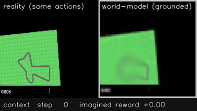
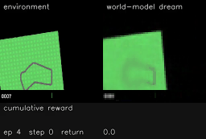
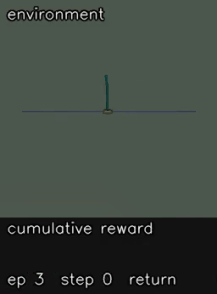

# Enhanced World Model

An extensible and modular reimplementation of Ha & Schmidhuber's
_Recurrent World Models Facilitate Policy Evolution (2018)_, now extended with a from-scratch **DreamerV3**-style agent ([Hafner et al., 2023](https://arxiv.org/abs/2301.04104))
that learns to act by _dreaming_ inside its own latent world model.

This project provides a flexible framework for experimenting with modern world-model
architectures in reinforcement learning. It enables researchers to easily swap vision,
memory, and controller components while preserving a unified training pipeline, and
also ships a standalone Dreamer agent trained entirely on imagined latent rollouts.

> The Dreamer agent here was trained on an **Apple-Silicon MacBook Air (MPS — no CUDA)**.

<p align="center"></p>

> **The agent driving inside a world it imagines.** After a few real frames the environment
> is switched off; the right panel is generated entirely from the model's latent state — it
> hallucinates the track, the car and the grass, and the policy keeps driving inside that dream.

---

## Highlights

- **Modular PPO world-model framework** — pluggable vision / memory / controller
  components, trained end-to-end or independently via pretraining.
- **DreamerV3-lite from scratch** — a categorical RSSM world model (KL balancing + free
  bits, symlog two-hot reward/value heads) with an actor-critic trained **purely on
  imagined latent rollouts**. ~11M params, MPS-friendly.
- **CarRacing-v3 from pixels:** mean return **≈ 632** over 5 episodes (random ≈ −30) with Dreamer.
- **Custom MuJoCo triple inverted pendulum** environment + a balancing agent.
- **Pluggable components everywhere:** swap encoder / dynamics / actor / critic (Dreamer)
  or vision / memory / controller (PPO framework) by name via a registry.

## Architecture Overview

The enhanced world model is composed of three interchangeable modules:

1. **Vision Model** – Encodes observations into latent representations
2. **Memory Model** – Models temporal dynamics in latent space
3. **Controller** – Produces actions based on latent states

Each component can be independently selected and trained, enabling rapid experimentation
with different architectures.

The Dreamer agent follows the same modular philosophy but with its own architecture:

```
observation ─► Encoder ─► embed ─┐
                                 ▼
        ┌──────────── RSSM  (GRU deterministic h + categorical stochastic z) ───────────┐
        │      posterior q(z | h, embed)        prior p(z | h)   ← used for imagination   │
        └───────────────────────────────┬───────────────────────────────────────────────┘
                       feat = [h, z] ────┼──► Decoder        (reconstruct observation)
                                         ├──► Reward head    (two-hot symlog)
                                         ├──► Continue head  (discount γ)
                                         ├──► Actor   ┐  trained on imagined rollouts
                                         └──► Critic  ┘  with λ-returns (real env never
                                                         touched during the AC update)
```

The world model compresses observations into a latent state and learns to predict its
own future. The **actor-critic is trained entirely on short trajectories imagined by
rolling the latent prior forward** — the real environment is only used to collect data
for the world model. DreamerV3 ingredients implemented here: symlog + two-hot regression,
KL balancing with free bits, percentile return normalization, straight-through categorical
latents, and an EMA target critic.

## Features

- **Modular design** allowing independent vision, memory and controller components
- **Flexible training pipeline** supporting multiple environments and model architectures
- **Reproducible experiments** through explicit configuration and seeding
- **Honest experiments:** a domain-randomization robustness study and the limits of the
  triple-pendulum agent, written up as findings (see below)

## Results (Dreamer agent)

| Task                               | Metric            | Result        | Reference                     |
| ---------------------------------- | ----------------- | ------------- | ----------------------------- |
| CarRacing-v3 (pixels)              | mean return, 5 ep | **632**       | random ≈ −30 · "solved" ≈ 900 |
| CarRacing-v3, unseen random tracks | mean return, 6 ep | **377 ± 246** | generalizes to new tracks     |
| CartPole-v1                        | return            | solved        | —                             |
| Triple inverted pendulum (custom)  | balance time      | **~2 s**      | random ≈ instant fall         |

## Demos

|         CarRacing — driving          |         World-model "dream"          |             Triple pendulum             |
| :----------------------------------: | :----------------------------------: | :-------------------------------------: |
|  |  |  |

_Left → right: the trained agent driving · the agent acting inside its imagined world ·
the custom 3-link inverted pendulum balanced on a cart._

## Environments

The framework targets compatibility with environments provided by **Gymnasium**.
https://gymnasium.farama.org

Currently tested environments:

- CartPole-v1
- CarRacing-v3
- InvertedTriplePendulum-v0 (custom MuJoCo environment, ships with this repo)

## Requirements

- Python **3.11 – 3.12.11**
- NVIDIA GPU recommended for vision-based environments
  or
- Apple-Silicon MPS

## Installation

This project uses **uv** for dependency management.

- Clone the repository
  ```
  $ git clone https://github.com/tensaura/Enhanced-World-Model/
  ```
- Install dependencies
  ```
  $ uv sync
  ```

---

## Training — modular PPO world-model framework

To train or pretrain models, run `src/main.py`.

The accepted arguments are:

### Interface

- `--ui` to use the Gradio web interface. Not compatible with `--cli`.
- `--cli` to use the CLI. Not compatible with `--ui`.

### Environment & Training

- `--env` to set the environment to use.
- `--vision` to set the vision model to use. Loading an existing model will overwrite this argument.
- `--memory` to set the memory model to use. Loading an existing model will overwrite this argument.
- `--controller` to set the controller model to use. Loading an existing model will overwrite this argument.
- `--epochs` to set the number of epochs to run.
- `--patience` to set the number of iterations without noticeable improvement before early stopping.
- `--batch-size` to set the number of environments to run in parallel. Can be set automatically with `auto`.
- `--lr` the learning rate for the model, except the controller model.
- `--dropout` to control the dropout rate.
- `--render-mode` to set render mode between `human` and `rgb_array` (no render).
- `--seed` to set the seed.
- `--save-path` for the path to save the model.
- `--load-path` to load an existing model.
- `--patch-load-path` to modularly load a model on top of the existing model.
- `--patch` to specify which parts (vision, memory, controller) to load with `--patch-load-path`.
- `--save-freq` the number of epochs between each save.
- `--log-freq` the number of epochs between each log.
- `--tensorboard` whether to log gradients and losses into TensorBoard.

For example, if you want to train a model on CartPole-v3, run:

```
$ python src/main.py --env CartPole-v3
```

To use specific models, run (as an example):

```
$ python src/main.py --env CartPole-v3 --vision VQ_VAE --memory LSTMMemory --controller DeepContinuousController
```

### PPO Configuration

The controller is trained using Proximal Policy Optimization (PPO).
The following arguments control the PPO training process:

- `--rollout-steps` the number of rollout steps.
- `--ppo-epochs` the number of PPO epochs.
- `--ppo-lr` for the PPO learning rate.
- `--ppo-batch-size` the batch size for PPO updates by batch.
- `--ppo-clip-range` the interval for PPO gradient clipping.
- `--ppo-range-vf` the value function for PPO gradient clipping.
- `--gamma` the discount factor.
- `--gae-lambda` the GAE lambda parameter.
- `--value-coef` the coefficient for the value loss.
- `--entropy-coef` the coefficient for the entropy loss.
- `--max-grad-norm` the value to clip gradients at.
- `--train-world-model` whether to train vision and memory too.
- `--world-model-epochs` the number of epochs per rollout to train vision and memory.

### Inference

To infer on pretrained models, run `src/inference.py`.

The accepted arguments are:

- `--load-path` the path to the pretrained model.
- `--episodes` the number of episodes to infer on.
- `--render-mode` to set render mode between `human` and `rgb_array` (no render).

---

## Training — Dreamer agent (latent imagination)

The Dreamer agent has its own standalone entry point, auto-detecting image vs. vector
environments:

```bash
uv sync                                   # Python 3.11–3.12

PYTHONPATH=src uv run python src/dreamer/train.py --env CartPole-v1 --total-steps 20000
PYTHONPATH=src uv run python src/dreamer/train.py --env CarRacing-v3 --total-steps 300000 \
    --seq-len 50 --batch-size 16 --deter-dim 256 --cnn-depth 32 --action-repeat 2
PYTHONPATH=src uv run python src/dreamer/train.py --env InvertedTriplePendulum-v0 \
    --total-steps 300000 --action-repeat 1 --deter-dim 256 --entropy-scale 2e-3

# Showcase tooling
PYTHONPATH=src uv run python src/dreamer/record_demo.py   --checkpoint <ckpt> --env <env> --out demo/run
PYTHONPATH=src uv run python src/dreamer/dream_rollout.py --checkpoint <ckpt> --env CarRacing-v3 --out demo/dream
PYTHONPATH=src uv run python src/dreamer/eval_tests.py    --checkpoint <ckpt> --env CarRacing-v3 --tests 6 --stochastic
```

Checkpoints (`dreamer_<env>_best.pt`, `_step<N>.pt`, `_final.pt`) are written to `--save-path`.
Resume with `--load-path <ckpt>`.

### Long / overnight runs (macOS)

```bash
# caffeinate stops idle/system sleep (which suspends training); nohup detaches the run.
PYTHONPATH=src nohup uv run python src/dreamer/train.py \
    --env CarRacing-v3 --total-steps 300000 --tensorboard \
    > train.log 2>&1 &
echo $! > train.pid
nohup caffeinate -i -m -s -w "$(cat train.pid)" >/dev/null 2>&1 &
```

> **MacBook note:** `caffeinate` cannot override _clamshell_ sleep — keep the lid open (or
> external display + AC). At `deter 256 / cnn 32` throughput is ≈ 8–9 env-steps/s on MPS.

### Pluggable components (Dreamer)

Dreamer's world-model pieces are selected from registries, mirroring the project's modular
philosophy. Add a new component and use it with one line — no agent changes:

```python
from dreamer.networks import Dynamics

class MyTransformerDynamics(Dynamics):          # auto-registers as "MyTransformerDynamics"
    @classmethod
    def from_config(cls, cfg, embed_dim): ...
    # implement initial / obs_step / img_step / get_feat / feat_dim

# select it:  DreamerConfig(..., dynamics="MyTransformerDynamics")
```

Registries: `ENCODER_REGISTRY`, `DECODER_REGISTRY`, `DYNAMICS_REGISTRY`, `ACTOR_REGISTRY`,
`CRITIC_REGISTRY`. `DreamerConfig` picks each by name (empty = modality-appropriate default).

---

## Repo layout

```
src/dreamer/            DreamerV3-lite — networks, models (agent), replay, train, env,
                        triple_pendulum (custom MuJoCo env), record_demo, dream_rollout, eval_tests
src/{vision,memory,controller}/   original modular PPO world-model framework (registry-based)
tests/test_dreamer.py   unit tests for the Dreamer agent (math, world model, actor-critic)
```

## Experiments & honest findings

- **Domain-randomization robustness.** The Dreamer agent generalizes to unseen track
  _shapes_ but collapses under `domain_randomize` (random colors) — and the world-model
  reconstruction shows why. The study also surfaced that CarRacing's `domain_randomize`
  is partly **ill-posed**: it can sample road ≈ grass colour → genuinely unwinnable maps.
  Fine-tuning taught the vision to _see_ random palettes but didn't yield a clean robustness
  win on a broken benchmark.
- **Triple inverted pendulum.** A from-scratch MuJoCo env. The agent stands all three links
  upright for ~2s but doesn't fully stabilize; the bottleneck is reaction speed on the
  chaotic dynamics, not (as first hypothesized) cart-rail length.
- **Train vs. eval gap.** The training rolling-mean reward repeatedly disagreed with held-out
  greedy evaluation — a reminder to score on a fixed protocol, not the training metric.

## Limitations & next steps

- Single-environment data collection (slow); vectorized envs would speed training markedly.
- CarRacing 632 is strong but not "solved" (~900) — more steps on a non-throttling GPU should
  close the gap.
- No automated eval harness yet (evaluation runs through the demo/eval scripts).

---

## What you can do

You can train your own models, using the implemented vision, memory and controller sub
models, or the Dreamer agent. Alternatively, you can use the pretrained models provided
and run them on their respective environments.

## Quick Start

```bash
uv sync
python src/main.py --env CartPole-v1 --render-mode human
```

## References

- DreamerV3 — _Mastering Diverse Domains through World Models_ — https://arxiv.org/abs/2301.04104
- World Models (Ha & Schmidhuber, 2018) — https://worldmodels.github.io
